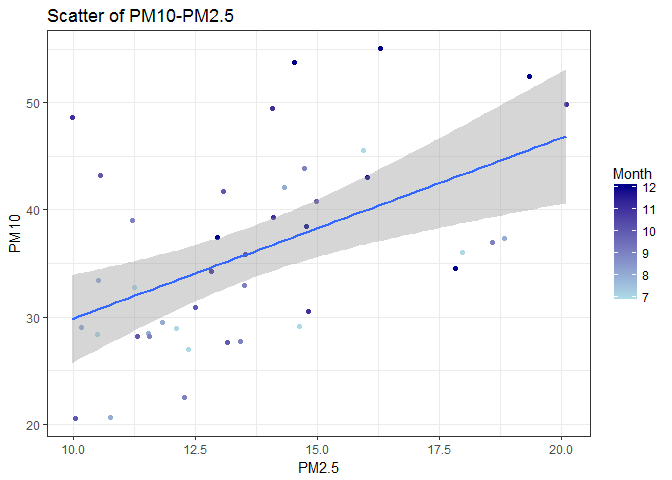
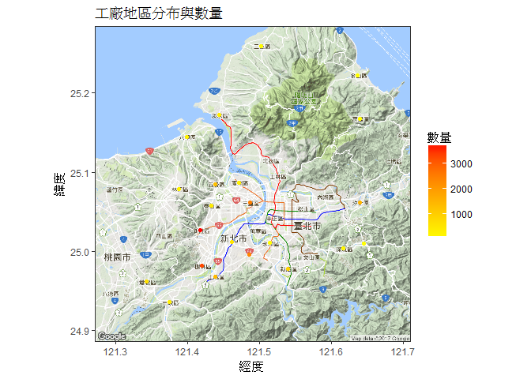
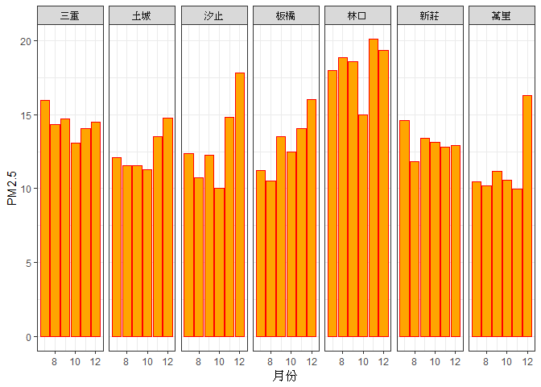
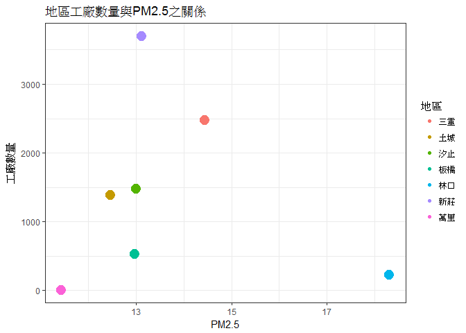
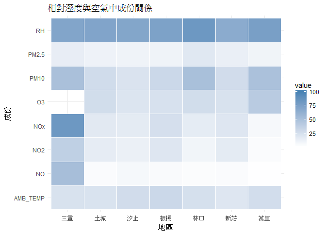

長庚大學 大數據分析方法 作業六
================

分析議題背景
------------

PM 就是英文Particulate Matter（顆粒物）的縮寫。 PM10代表空氣中空氣動力學粒徑小於等於10微米的所有顆粒物； PM2.5代表空氣中空氣動力學粒徑小於等於2.5微米的所有顆粒物；又稱細顆粒，細顆粒進入肺泡。 由此可見，PM10中包含粒徑小於2.5微米的顆粒物，即PM10包含PM2.5。世界衛生組織（WHO）指出： 對於發展中國家的城市：PM10中有近一半是PM2.5； 對於已開發國家城市:PM10中PM2.5占50%至80%。由此，當空氣中PM2.5的濃度數據增加時，PM10的濃度數據就會升高。故目前歐盟國家仍然只監測PM10的濃度數據。 PM10能被人直接吸入呼吸道，但部分可通過痰液等排出體外，也會被鼻腔內部的絨毛阻擋，對人體健康危害相對較小。不過PM10對於能見度和溫度的影響非常明顯。 PM2.5通過呼吸可以到達肺部。這些顆粒物在肺泡上沉積下來，會干擾肺部的氣體交換，損傷肺泡和粘膜，引起肺組織的慢性纖維化，導致肺心病，加重哮喘病，引起慢性鼻咽炎、慢性支氣管炎等一系列病變，這些顆粒物還可以通過支氣管和肺泡進入血液，其中的有害氣體、重金屬等溶解在血液中，嚴重的可危及生命，對兒童和老年人的危害尤為明顯。

分析動機
--------

相信大家都對PM10及PM2.5這幾個名詞不陌生了，也知道它對人體健康會有危害，因此我們找出開放資料，就北部幾個區域於2016/12/31這一天的情況來比較看看到底是哪裡的空氣最髒，再來看看工廠在各區的分布多寡和空氣汙染的高低有沒有關聯。

使用資料
--------

關於讀入資料之欄位名稱及內容說明 普通測站資料註記說明： \`\# 表示儀器檢核為無效值 \* 表示程式檢核為無效值 x 表示人工檢核為無效值 NR 表示無降雨(已更改過) 空白 表示缺值

測項簡稱 單位 測項名稱 SO2 ppb 二氧化硫 CO ppm 一氧化碳 O3 ppb 臭氧 PM10 μg/m3 懸浮微粒 PM2.5 μg/m3 細懸浮微粒 NOX ppb 氮氧化物 NO ppb 一氧化氮 NO2 ppb 二氧化氮 THC ppm 總碳氫合物 NMHC ppm 非甲烷碳氫化合物 CH4 ppm 甲烷 UVB UVI 紫外線指數 AMB\_TEMP ℃ 大氣溫度 RAINFALL mm 雨量 RH % 相對溼度 WIND\_SPEED m/sec 風速(以每小時最後10分鐘算術平均) WIND\_DIREC degress 風向(以每小時最後10分鐘向量平均) WS\_HR m/sec 風速小時值(以整個小時算術平均) WD\_HR degress 風向小時值(以整個小時向量平均) PH\_RAIN pH 酸鹼值(酸雨) RAIN\_COND μS/cm 導電度(酸雨)

載入使用資料們

``` r
#這是R Code Chunk
library(readr)
```

    ## Warning: package 'readr' was built under R version 3.3.3

``` r
library(readxl)
```

    ## Warning: package 'readxl' was built under R version 3.3.3

``` r
Banqiao <- read_excel("D:/BigDataHW/HW6/NewTaipeiCity/105年板橋站_20170217.xls")
Linkou <- read_excel("D:/BigDataHW/HW6/NewTaipeiCity/105年林口站_20170217.xls")
```

    ## Warning in read_fun(path = path, sheet = sheet, limits = limits, shim =
    ## shim, : Expecting numeric in Z1377 / R1377C26: got '-0.8*'

    ## Warning in read_fun(path = path, sheet = sheet, limits = limits, shim =
    ## shim, : Expecting numeric in AA1377 / R1377C27: got '-0.9*'

    ## Warning in read_fun(path = path, sheet = sheet, limits = limits, shim =
    ## shim, : Expecting numeric in Z1602 / R1602C26: got '-0.6*'

    ## Warning in read_fun(path = path, sheet = sheet, limits = limits, shim =
    ## shim, : Expecting numeric in AA1602 / R1602C27: got '-0.9*'

    ## Warning in read_fun(path = path, sheet = sheet, limits = limits, shim =
    ## shim, : Expecting numeric in X1677 / R1677C24: got '-0.5x'

    ## Warning in read_fun(path = path, sheet = sheet, limits = limits, shim =
    ## shim, : Expecting numeric in Y1677 / R1677C25: got '-0.8*'

    ## Warning in read_fun(path = path, sheet = sheet, limits = limits, shim =
    ## shim, : Expecting numeric in Z1677 / R1677C26: got '-1*'

    ## Warning in read_fun(path = path, sheet = sheet, limits = limits, shim =
    ## shim, : Expecting numeric in AA1677 / R1677C27: got '-2.3*'

    ## Warning in read_fun(path = path, sheet = sheet, limits = limits, shim =
    ## shim, : Expecting numeric in E1917 / R1917C5: got '-1#'

    ## Warning in read_fun(path = path, sheet = sheet, limits = limits, shim =
    ## shim, : Expecting numeric in F1917 / R1917C6: got '-1#'

    ## Warning in read_fun(path = path, sheet = sheet, limits = limits, shim =
    ## shim, : Expecting numeric in H1917 / R1917C8: got '-1#'

    ## Warning in read_fun(path = path, sheet = sheet, limits = limits, shim =
    ## shim, : Expecting numeric in M1917 / R1917C13: got '-1#'

    ## Warning in read_fun(path = path, sheet = sheet, limits = limits, shim =
    ## shim, : Expecting numeric in AA1962 / R1962C27: got '-0.6*'

    ## Warning in read_fun(path = path, sheet = sheet, limits = limits, shim =
    ## shim, : Expecting numeric in E2052 / R2052C5: got '5.7x'

    ## Warning in read_fun(path = path, sheet = sheet, limits = limits, shim =
    ## shim, : Expecting numeric in F2052 / R2052C6: got '7.5x'

    ## Warning in read_fun(path = path, sheet = sheet, limits = limits, shim =
    ## shim, : Expecting numeric in H2052 / R2052C8: got '0.9x'

    ## Warning in read_fun(path = path, sheet = sheet, limits = limits, shim =
    ## shim, : Expecting numeric in M2052 / R2052C13: got '1.2#'

    ## Warning in read_fun(path = path, sheet = sheet, limits = limits, shim =
    ## shim, : Expecting numeric in AA2349 / R2349C27: got '0#'

    ## Warning in read_fun(path = path, sheet = sheet, limits = limits, shim =
    ## shim, : Expecting numeric in X2712 / R2712C24: got '-0.9*'

    ## Warning in read_fun(path = path, sheet = sheet, limits = limits, shim =
    ## shim, : Expecting numeric in Y2712 / R2712C25: got '-0.5x'

    ## Warning in read_fun(path = path, sheet = sheet, limits = limits, shim =
    ## shim, : Expecting numeric in Z2712 / R2712C26: got '0.3x'

    ## Warning in read_fun(path = path, sheet = sheet, limits = limits, shim =
    ## shim, : Expecting numeric in AA2712 / R2712C27: got '-0.7*'

    ## Warning in read_fun(path = path, sheet = sheet, limits = limits, shim =
    ## shim, : Expecting numeric in X3492 / R3492C24: got '-0.7*'

    ## Warning in read_fun(path = path, sheet = sheet, limits = limits, shim =
    ## shim, : Expecting numeric in X3519 / R3519C24: got '23*'

    ## Warning in read_fun(path = path, sheet = sheet, limits = limits, shim =
    ## shim, : Expecting numeric in X4227 / R4227C24: got '-0.5x'

    ## Warning in read_fun(path = path, sheet = sheet, limits = limits, shim =
    ## shim, : Expecting numeric in Y4227 / R4227C25: got '-1.2*'

    ## Warning in read_fun(path = path, sheet = sheet, limits = limits, shim =
    ## shim, : Expecting numeric in Z4227 / R4227C26: got '-1.9*'

    ## Warning in read_fun(path = path, sheet = sheet, limits = limits, shim =
    ## shim, : Expecting numeric in AA4227 / R4227C27: got '-2.3*'

    ## Warning in read_fun(path = path, sheet = sheet, limits = limits, shim =
    ## shim, : Expecting numeric in X4507 / R4507C24: got '18*'

    ## Warning in read_fun(path = path, sheet = sheet, limits = limits, shim =
    ## shim, : Expecting numeric in X4692 / R4692C24: got '-1.6*'

    ## Warning in read_fun(path = path, sheet = sheet, limits = limits, shim =
    ## shim, : Expecting numeric in Y4692 / R4692C25: got '-1.7*'

    ## Warning in read_fun(path = path, sheet = sheet, limits = limits, shim =
    ## shim, : Expecting numeric in Z4692 / R4692C26: got '-1.7*'

    ## Warning in read_fun(path = path, sheet = sheet, limits = limits, shim =
    ## shim, : Expecting numeric in AA4692 / R4692C27: got '-1.8*'

    ## Warning in read_fun(path = path, sheet = sheet, limits = limits, shim =
    ## shim, : Expecting numeric in X4762 / R4762C24: got '18*'

    ## Warning in read_fun(path = path, sheet = sheet, limits = limits, shim =
    ## shim, : Expecting numeric in Z4872 / R4872C26: got '-0.6*'

    ## Warning in read_fun(path = path, sheet = sheet, limits = limits, shim =
    ## shim, : Expecting numeric in AA4872 / R4872C27: got '-1*'

    ## Warning in read_fun(path = path, sheet = sheet, limits = limits, shim =
    ## shim, : Expecting numeric in Y4902 / R4902C25: got '-0.6*'

    ## Warning in read_fun(path = path, sheet = sheet, limits = limits, shim =
    ## shim, : Expecting numeric in Z4902 / R4902C26: got '-0.7*'

    ## Warning in read_fun(path = path, sheet = sheet, limits = limits, shim =
    ## shim, : Expecting numeric in AA4902 / R4902C27: got '-0.8*'

    ## Warning in read_fun(path = path, sheet = sheet, limits = limits, shim =
    ## shim, : Expecting numeric in X4914 / R4914C24: got '0#'

``` r
Sanchong <- read_excel("D:/BigDataHW/HW6/NewTaipeiCity/105年三重站_20170217.xls")
```

    ## Warning in read_fun(path = path, sheet = sheet, limits = limits, shim =
    ## shim, : Expecting numeric in J1013 / R1013C10: got '37x'

    ## Warning in read_fun(path = path, sheet = sheet, limits = limits, shim =
    ## shim, : Expecting numeric in K1013 / R1013C11: got '17x'

    ## Warning in read_fun(path = path, sheet = sheet, limits = limits, shim =
    ## shim, : Expecting numeric in Z2090 / R2090C26: got '17*'

    ## Warning in read_fun(path = path, sheet = sheet, limits = limits, shim =
    ## shim, : Expecting numeric in AA2090 / R2090C27: got '17*'

    ## Warning in read_fun(path = path, sheet = sheet, limits = limits, shim =
    ## shim, : Expecting numeric in J2470 / R2470C10: got '-0.1x'

    ## Warning in read_fun(path = path, sheet = sheet, limits = limits, shim =
    ## shim, : Expecting numeric in Z3273 / R3273C26: got '14*'

    ## Warning in read_fun(path = path, sheet = sheet, limits = limits, shim =
    ## shim, : Expecting numeric in E3367 / R3367C5: got '-0.2x'

    ## Warning in read_fun(path = path, sheet = sheet, limits = limits, shim =
    ## shim, : Expecting numeric in F3367 / R3367C6: got '-0.2x'

    ## Warning in read_fun(path = path, sheet = sheet, limits = limits, shim =
    ## shim, : Expecting numeric in H3367 / R3367C8: got '-0.3x'

    ## Warning in read_fun(path = path, sheet = sheet, limits = limits, shim =
    ## shim, : Expecting numeric in D3536 / R3536C4: got '-0.6*'

    ## Warning in read_fun(path = path, sheet = sheet, limits = limits, shim =
    ## shim, : Expecting numeric in H4004 / R4004C8: got '-0.4x'

    ## Warning in read_fun(path = path, sheet = sheet, limits = limits, shim =
    ## shim, : Expecting numeric in AA4004 / R4004C27: got '-0.3x'

    ## Warning in read_fun(path = path, sheet = sheet, limits = limits, shim =
    ## shim, : Expecting numeric in AA4095 / R4095C27: got '-0.6*'

    ## Warning in read_fun(path = path, sheet = sheet, limits = limits, shim =
    ## shim, : Expecting numeric in H4410 / R4410C8: got '2.1*'

    ## Warning in read_fun(path = path, sheet = sheet, limits = limits, shim =
    ## shim, : Expecting numeric in H4412 / R4412C8: got '4.05*'

    ## Warning in read_fun(path = path, sheet = sheet, limits = limits, shim =
    ## shim, : Expecting numeric in H4421 / R4421C8: got '6.2*'

    ## Warning in read_fun(path = path, sheet = sheet, limits = limits, shim =
    ## shim, : Expecting numeric in D4469 / R4469C4: got '40*'

    ## Warning in read_fun(path = path, sheet = sheet, limits = limits, shim =
    ## shim, : Expecting numeric in E4469 / R4469C5: got '40*'

    ## Warning in read_fun(path = path, sheet = sheet, limits = limits, shim =
    ## shim, : Expecting numeric in F4469 / R4469C6: got '36*'

    ## Warning in read_fun(path = path, sheet = sheet, limits = limits, shim =
    ## shim, : Expecting numeric in K4563 / R4563C11: got '4.4#'

``` r
Tucheng <- read_excel("D:/BigDataHW/HW6/NewTaipeiCity/105年土城站_20170217.xls")
WanLi <- read_excel("D:/BigDataHW/HW6/NewTaipeiCity/105年萬里站_20170217.xls")
```

    ## Warning in read_fun(path = path, sheet = sheet, limits = limits, shim =
    ## shim, : Expecting numeric in X1738 / R1738C24: got '0.8#'

    ## Warning in read_fun(path = path, sheet = sheet, limits = limits, shim =
    ## shim, : Expecting numeric in X1739 / R1739C24: got '3.5#'

    ## Warning in read_fun(path = path, sheet = sheet, limits = limits, shim =
    ## shim, : Expecting numeric in X1740 / R1740C24: got '4.2#'

    ## Warning in read_fun(path = path, sheet = sheet, limits = limits, shim =
    ## shim, : Expecting numeric in W1891 / R1891C23: got '2.2x'

    ## Warning in read_fun(path = path, sheet = sheet, limits = limits, shim =
    ## shim, : Expecting numeric in X1891 / R1891C24: got '-0.4x'

    ## Warning in read_fun(path = path, sheet = sheet, limits = limits, shim =
    ## shim, : Expecting numeric in Y1891 / R1891C25: got '-0.3x'

    ## Warning in read_fun(path = path, sheet = sheet, limits = limits, shim =
    ## shim, : Expecting numeric in W1892 / R1892C23: got '17x'

    ## Warning in read_fun(path = path, sheet = sheet, limits = limits, shim =
    ## shim, : Expecting numeric in X1892 / R1892C24: got '19x'

    ## Warning in read_fun(path = path, sheet = sheet, limits = limits, shim =
    ## shim, : Expecting numeric in Y1892 / R1892C25: got '15x'

    ## Warning in read_fun(path = path, sheet = sheet, limits = limits, shim =
    ## shim, : Expecting numeric in W1893 / R1893C23: got '19x'

    ## Warning in read_fun(path = path, sheet = sheet, limits = limits, shim =
    ## shim, : Expecting numeric in X1893 / R1893C24: got '19x'

    ## Warning in read_fun(path = path, sheet = sheet, limits = limits, shim =
    ## shim, : Expecting numeric in Y1893 / R1893C25: got '15x'

    ## Warning in read_fun(path = path, sheet = sheet, limits = limits, shim =
    ## shim, : Expecting numeric in D1908 / R1908C4: got '-1.1*'

    ## Warning in read_fun(path = path, sheet = sheet, limits = limits, shim =
    ## shim, : Expecting numeric in F1908 / R1908C6: got '-1.2*'

    ## Warning in read_fun(path = path, sheet = sheet, limits = limits, shim =
    ## shim, : Expecting numeric in G1908 / R1908C7: got '1.5x'

    ## Warning in read_fun(path = path, sheet = sheet, limits = limits, shim =
    ## shim, : Expecting numeric in L1908 / R1908C12: got '4.8x'

    ## Warning in read_fun(path = path, sheet = sheet, limits = limits, shim =
    ## shim, : Expecting numeric in M1908 / R1908C13: got '6.5x'

    ## Warning in read_fun(path = path, sheet = sheet, limits = limits, shim =
    ## shim, : Expecting numeric in D1909 / R1909C4: got '7*'

    ## Warning in read_fun(path = path, sheet = sheet, limits = limits, shim =
    ## shim, : Expecting numeric in F1909 / R1909C6: got '6.7*'

    ## Warning in read_fun(path = path, sheet = sheet, limits = limits, shim =
    ## shim, : Expecting numeric in G1909 / R1909C7: got '6.4x'

    ## Warning in read_fun(path = path, sheet = sheet, limits = limits, shim =
    ## shim, : Expecting numeric in L1909 / R1909C12: got '7.4x'

    ## Warning in read_fun(path = path, sheet = sheet, limits = limits, shim =
    ## shim, : Expecting numeric in M1909 / R1909C13: got '9.5x'

    ## Warning in read_fun(path = path, sheet = sheet, limits = limits, shim =
    ## shim, : Expecting numeric in D1910 / R1910C4: got '5.9*'

    ## Warning in read_fun(path = path, sheet = sheet, limits = limits, shim =
    ## shim, : Expecting numeric in F1910 / R1910C6: got '5.4*'

    ## Warning in read_fun(path = path, sheet = sheet, limits = limits, shim =
    ## shim, : Expecting numeric in G1910 / R1910C7: got '7.9x'

    ## Warning in read_fun(path = path, sheet = sheet, limits = limits, shim =
    ## shim, : Expecting numeric in L1910 / R1910C12: got '12x'

    ## Warning in read_fun(path = path, sheet = sheet, limits = limits, shim =
    ## shim, : Expecting numeric in M1910 / R1910C13: got '16x'

    ## Warning in read_fun(path = path, sheet = sheet, limits = limits, shim =
    ## shim, : Expecting numeric in L1911 / R1911C12: got '21#'

    ## Warning in read_fun(path = path, sheet = sheet, limits = limits, shim =
    ## shim, : Expecting numeric in X2264 / R2264C24: got '0.14*'

    ## Warning in read_fun(path = path, sheet = sheet, limits = limits, shim =
    ## shim, : Expecting numeric in L2281 / R2281C12: got '0.12*'

    ## Warning in read_fun(path = path, sheet = sheet, limits = limits, shim =
    ## shim, : Expecting numeric in X2642 / R2642C24: got '25#'

    ## Warning in read_fun(path = path, sheet = sheet, limits = limits, shim =
    ## shim, : Expecting numeric in L2870 / R2870C12: got '3.9#'

    ## Warning in read_fun(path = path, sheet = sheet, limits = limits, shim =
    ## shim, : Expecting numeric in L2938 / R2938C12: got '3.5#'

    ## Warning in read_fun(path = path, sheet = sheet, limits = limits, shim =
    ## shim, : Expecting numeric in L2962 / R2962C12: got '5.1#'

    ## Warning in read_fun(path = path, sheet = sheet, limits = limits, shim =
    ## shim, : Expecting numeric in L2963 / R2963C12: got '13#'

    ## Warning in read_fun(path = path, sheet = sheet, limits = limits, shim =
    ## shim, : Expecting numeric in L2964 / R2964C12: got '18#'

    ## Warning in read_fun(path = path, sheet = sheet, limits = limits, shim =
    ## shim, : Expecting numeric in G3183 / R3183C7: got '0#'

    ## Warning in read_fun(path = path, sheet = sheet, limits = limits, shim =
    ## shim, : Expecting numeric in M3183 / R3183C13: got '1.8#'

    ## Warning in read_fun(path = path, sheet = sheet, limits = limits, shim =
    ## shim, : Expecting numeric in G3184 / R3184C7: got '2.4#'

    ## Warning in read_fun(path = path, sheet = sheet, limits = limits, shim =
    ## shim, : Expecting numeric in M3184 / R3184C13: got '1.9#'

    ## Warning in read_fun(path = path, sheet = sheet, limits = limits, shim =
    ## shim, : Expecting numeric in G3185 / R3185C7: got '2.4#'

    ## Warning in read_fun(path = path, sheet = sheet, limits = limits, shim =
    ## shim, : Expecting numeric in M3185 / R3185C13: got '3.7#'

    ## Warning in read_fun(path = path, sheet = sheet, limits = limits, shim =
    ## shim, : Expecting numeric in L3234 / R3234C12: got '0.8#'

    ## Warning in read_fun(path = path, sheet = sheet, limits = limits, shim =
    ## shim, : Expecting numeric in M3234 / R3234C13: got '1.1x'

    ## Warning in read_fun(path = path, sheet = sheet, limits = limits, shim =
    ## shim, : Expecting numeric in L3235 / R3235C12: got '2.1#'

    ## Warning in read_fun(path = path, sheet = sheet, limits = limits, shim =
    ## shim, : Expecting numeric in M3235 / R3235C13: got '2x'

    ## Warning in read_fun(path = path, sheet = sheet, limits = limits, shim =
    ## shim, : Expecting numeric in L3236 / R3236C12: got '2.9#'

    ## Warning in read_fun(path = path, sheet = sheet, limits = limits, shim =
    ## shim, : Expecting numeric in M3236 / R3236C13: got '3.1x'

    ## Warning in read_fun(path = path, sheet = sheet, limits = limits, shim =
    ## shim, : Expecting numeric in F3302 / R3302C6: got '0.3*'

    ## Warning in read_fun(path = path, sheet = sheet, limits = limits, shim =
    ## shim, : Expecting numeric in F3303 / R3303C6: got '-0.8*'

    ## Warning in read_fun(path = path, sheet = sheet, limits = limits, shim =
    ## shim, : Expecting numeric in F3304 / R3304C6: got '-0.5*'

    ## Warning in read_fun(path = path, sheet = sheet, limits = limits, shim =
    ## shim, : Expecting numeric in F3699 / R3699C6: got '8x'

    ## Warning in read_fun(path = path, sheet = sheet, limits = limits, shim =
    ## shim, : Expecting numeric in L3699 / R3699C12: got '8x'

    ## Warning in read_fun(path = path, sheet = sheet, limits = limits, shim =
    ## shim, : Expecting numeric in M3699 / R3699C13: got '8x'

    ## Warning in read_fun(path = path, sheet = sheet, limits = limits, shim =
    ## shim, : Expecting numeric in D4168 / R4168C4: got '0.24x'

    ## Warning in read_fun(path = path, sheet = sheet, limits = limits, shim =
    ## shim, : Expecting numeric in F4168 / R4168C6: got '0.28x'

    ## Warning in read_fun(path = path, sheet = sheet, limits = limits, shim =
    ## shim, : Expecting numeric in G4168 / R4168C7: got '1.82#'

    ## Warning in read_fun(path = path, sheet = sheet, limits = limits, shim =
    ## shim, : Expecting numeric in L4168 / R4168C12: got '0.46#'

    ## Warning in read_fun(path = path, sheet = sheet, limits = limits, shim =
    ## shim, : Expecting numeric in M4168 / R4168C13: got '0.46#'

    ## Warning in read_fun(path = path, sheet = sheet, limits = limits, shim =
    ## shim, : Expecting numeric in Y4525 / R4525C25: got '0.12*'

    ## Warning in read_fun(path = path, sheet = sheet, limits = limits, shim =
    ## shim, : Expecting numeric in W4617 / R4617C23: got '24x'

    ## Warning in read_fun(path = path, sheet = sheet, limits = limits, shim =
    ## shim, : Expecting numeric in X4617 / R4617C24: got '24x'

    ## Warning in read_fun(path = path, sheet = sheet, limits = limits, shim =
    ## shim, : Expecting numeric in Y4617 / R4617C25: got '24x'

    ## Warning in read_fun(path = path, sheet = sheet, limits = limits, shim =
    ## shim, : Expecting numeric in D4634 / R4634C4: got '24x'

    ## Warning in read_fun(path = path, sheet = sheet, limits = limits, shim =
    ## shim, : Expecting numeric in F4634 / R4634C6: got '24x'

    ## Warning in read_fun(path = path, sheet = sheet, limits = limits, shim =
    ## shim, : Expecting numeric in G4634 / R4634C7: got '24x'

    ## Warning in read_fun(path = path, sheet = sheet, limits = limits, shim =
    ## shim, : Expecting numeric in L4634 / R4634C12: got '24x'

    ## Warning in read_fun(path = path, sheet = sheet, limits = limits, shim =
    ## shim, : Expecting numeric in M4634 / R4634C13: got '24x'

    ## Warning in read_fun(path = path, sheet = sheet, limits = limits, shim =
    ## shim, : Expecting numeric in W4634 / R4634C23: got '28x'

    ## Warning in read_fun(path = path, sheet = sheet, limits = limits, shim =
    ## shim, : Expecting numeric in X4634 / R4634C24: got '25x'

    ## Warning in read_fun(path = path, sheet = sheet, limits = limits, shim =
    ## shim, : Expecting numeric in Y4634 / R4634C25: got '25x'

    ## Warning in read_fun(path = path, sheet = sheet, limits = limits, shim =
    ## shim, : Expecting numeric in D4651 / R4651C4: got '19x'

    ## Warning in read_fun(path = path, sheet = sheet, limits = limits, shim =
    ## shim, : Expecting numeric in F4651 / R4651C6: got '14x'

    ## Warning in read_fun(path = path, sheet = sheet, limits = limits, shim =
    ## shim, : Expecting numeric in G4651 / R4651C7: got '9x'

    ## Warning in read_fun(path = path, sheet = sheet, limits = limits, shim =
    ## shim, : Expecting numeric in L4651 / R4651C12: got '15x'

    ## Warning in read_fun(path = path, sheet = sheet, limits = limits, shim =
    ## shim, : Expecting numeric in M4651 / R4651C13: got '11x'

    ## Warning in read_fun(path = path, sheet = sheet, limits = limits, shim =
    ## shim, : Expecting numeric in W4651 / R4651C23: got '12x'

    ## Warning in read_fun(path = path, sheet = sheet, limits = limits, shim =
    ## shim, : Expecting numeric in X4651 / R4651C24: got '12x'

    ## Warning in read_fun(path = path, sheet = sheet, limits = limits, shim =
    ## shim, : Expecting numeric in Y4651 / R4651C25: got '12x'

    ## Warning in read_fun(path = path, sheet = sheet, limits = limits, shim =
    ## shim, : Expecting numeric in D4668 / R4668C4: got '12x'

    ## Warning in read_fun(path = path, sheet = sheet, limits = limits, shim =
    ## shim, : Expecting numeric in F4668 / R4668C6: got '12x'

    ## Warning in read_fun(path = path, sheet = sheet, limits = limits, shim =
    ## shim, : Expecting numeric in G4668 / R4668C7: got '12x'

    ## Warning in read_fun(path = path, sheet = sheet, limits = limits, shim =
    ## shim, : Expecting numeric in L4668 / R4668C12: got '447*'

    ## Warning in read_fun(path = path, sheet = sheet, limits = limits, shim =
    ## shim, : Expecting numeric in M4668 / R4668C13: got '447*'

    ## Warning in read_fun(path = path, sheet = sheet, limits = limits, shim =
    ## shim, : Expecting numeric in W4668 / R4668C23: got '3x'

    ## Warning in read_fun(path = path, sheet = sheet, limits = limits, shim =
    ## shim, : Expecting numeric in X4668 / R4668C24: got '5x'

    ## Warning in read_fun(path = path, sheet = sheet, limits = limits, shim =
    ## shim, : Expecting numeric in Y4668 / R4668C25: got '5x'

    ## Warning in read_fun(path = path, sheet = sheet, limits = limits, shim =
    ## shim, : Expecting numeric in D4685 / R4685C4: got '4x'

    ## Warning in read_fun(path = path, sheet = sheet, limits = limits, shim =
    ## shim, : Expecting numeric in F4685 / R4685C6: got '2x'

    ## Warning in read_fun(path = path, sheet = sheet, limits = limits, shim =
    ## shim, : Expecting numeric in G4685 / R4685C7: got '2x'

    ## Warning in read_fun(path = path, sheet = sheet, limits = limits, shim =
    ## shim, : Expecting numeric in L4685 / R4685C12: got '8x'

    ## Warning in read_fun(path = path, sheet = sheet, limits = limits, shim =
    ## shim, : Expecting numeric in M4685 / R4685C13: got '9x'

    ## Warning in read_fun(path = path, sheet = sheet, limits = limits, shim =
    ## shim, : Expecting numeric in W4685 / R4685C23: got '6x'

    ## Warning in read_fun(path = path, sheet = sheet, limits = limits, shim =
    ## shim, : Expecting numeric in X4685 / R4685C24: got '6x'

    ## Warning in read_fun(path = path, sheet = sheet, limits = limits, shim =
    ## shim, : Expecting numeric in Y4685 / R4685C25: got '6x'

    ## Warning in read_fun(path = path, sheet = sheet, limits = limits, shim =
    ## shim, : Expecting numeric in D4702 / R4702C4: got '6x'

    ## Warning in read_fun(path = path, sheet = sheet, limits = limits, shim =
    ## shim, : Expecting numeric in F4702 / R4702C6: got '6x'

    ## Warning in read_fun(path = path, sheet = sheet, limits = limits, shim =
    ## shim, : Expecting numeric in G4702 / R4702C7: got '6x'

    ## Warning in read_fun(path = path, sheet = sheet, limits = limits, shim =
    ## shim, : Expecting numeric in L4702 / R4702C12: got '6x'

    ## Warning in read_fun(path = path, sheet = sheet, limits = limits, shim =
    ## shim, : Expecting numeric in M4702 / R4702C13: got '6x'

    ## Warning in read_fun(path = path, sheet = sheet, limits = limits, shim =
    ## shim, : Expecting numeric in W4702 / R4702C23: got '176*'

    ## Warning in read_fun(path = path, sheet = sheet, limits = limits, shim =
    ## shim, : Expecting numeric in X4702 / R4702C24: got '204*'

    ## Warning in read_fun(path = path, sheet = sheet, limits = limits, shim =
    ## shim, : Expecting numeric in Y4702 / R4702C25: got '227*'

    ## Warning in read_fun(path = path, sheet = sheet, limits = limits, shim =
    ## shim, : Expecting numeric in D4719 / R4719C4: got '285*'

    ## Warning in read_fun(path = path, sheet = sheet, limits = limits, shim =
    ## shim, : Expecting numeric in F4719 / R4719C6: got '339*'

    ## Warning in read_fun(path = path, sheet = sheet, limits = limits, shim =
    ## shim, : Expecting numeric in G4719 / R4719C7: got '374*'

    ## Warning in read_fun(path = path, sheet = sheet, limits = limits, shim =
    ## shim, : Expecting numeric in L4719 / R4719C12: got '447*'

    ## Warning in read_fun(path = path, sheet = sheet, limits = limits, shim =
    ## shim, : Expecting numeric in M4719 / R4719C13: got '2#'

    ## Warning in read_fun(path = path, sheet = sheet, limits = limits, shim =
    ## shim, : Expecting numeric in X4794 / R4794C24: got '11*'

    ## Warning in read_fun(path = path, sheet = sheet, limits = limits, shim =
    ## shim, : Expecting numeric in W4848 / R4848C23: got '0.1*'

    ## Warning in read_fun(path = path, sheet = sheet, limits = limits, shim =
    ## shim, : Expecting numeric in X5124 / R5124C24: got '58*'

    ## Warning in read_fun(path = path, sheet = sheet, limits = limits, shim =
    ## shim, : Expecting numeric in G5222 / R5222C7: got '0.1*'

    ## Warning in read_fun(path = path, sheet = sheet, limits = limits, shim =
    ## shim, : Expecting numeric in D5313 / R5313C4: got '0#'

    ## Warning in read_fun(path = path, sheet = sheet, limits = limits, shim =
    ## shim, : Expecting numeric in M5415 / R5415C13: got '2000*'

    ## Warning in read_fun(path = path, sheet = sheet, limits = limits, shim =
    ## shim, : Expecting numeric in M5416 / R5416C13: got '447*'

    ## Warning in read_fun(path = path, sheet = sheet, limits = limits, shim =
    ## shim, : Expecting numeric in L5534 / R5534C12: got '0*'

    ## Warning in read_fun(path = path, sheet = sheet, limits = limits, shim =
    ## shim, : Expecting numeric in X6157 / R6157C24: got '0.14*'

``` r
Xinzhuang <- read_excel("D:/BigDataHW/HW6/NewTaipeiCity/105年新莊站_20170217.xls")
Xizhi <- read_excel("D:/BigDataHW/HW6/NewTaipeiCity/105年汐止站_20170217.xls")
NewTaipeiFactoryLocation <- read_csv("D:/BigDataHW/HW6/NewTaipeiFactoryLocation_0002336861720153000188.csv")
```

    ## Parsed with column specification:
    ## cols(
    ##   PRF = col_character(),
    ##   FACT_NAME = col_character(),
    ##   REGI_ID = col_character(),
    ##   FACT_ADDR = col_character(),
    ##   RES_NAME = col_character(),
    ##   PRF8 = col_character(),
    ##   PRD8 = col_character(),
    ##   REGI_APP_DATE = col_character(),
    ##   STATUS = col_character()
    ## )

資料處理與清洗
--------------

說明處理資料的步驟 我們要先清洗出各站2016/12/31的資料，再把他們結合成一張表方便比對，再來將所有的數據charactor轉成num，由於資料表型態原本讀入是‘tbl\_df’, ‘tbl’ and 'data.frame'，將字串轉成num時會有是資料是list所以物件無法強制轉成double的問題，因此在這裡先把資料表轉成data.frame再將資料型態轉換，再新增一個欄位求出當日的個數據平均。 而工廠清洗，我們先洗出還在生產中的工廠，再新增一個欄位Area填入區域，方便後便製圖以及比較，只用group\_by和summarise求出每個區域有多少工廠，然後再以工廠數量來排序。 處理資料

``` r
#這是R Code Chunk
library(dplyr)
```

    ## Warning: package 'dplyr' was built under R version 3.3.3

    ## 
    ## Attaching package: 'dplyr'

    ## The following objects are masked from 'package:stats':
    ## 
    ##     filter, lag

    ## The following objects are masked from 'package:base':
    ## 
    ##     intersect, setdiff, setequal, union

``` r
library(ggmap)
```

    ## Warning: package 'ggmap' was built under R version 3.3.3

    ## Loading required package: ggplot2

    ## Warning: package 'ggplot2' was built under R version 3.3.3

``` r
#Banqiao
names(Banqiao)[names(Banqiao)=="日期"]="Date";
names(Banqiao)[names(Banqiao)=="測站"]="Station";
names(Banqiao)[names(Banqiao)=="測項"]="Item";
#Linkou
names(Linkou)[names(Linkou)=="日期"]="Date";
names(Linkou)[names(Linkou)=="測站"]="Station";
names(Linkou)[names(Linkou)=="測項"]="Item";
#Sanchong
names(Sanchong)[names(Sanchong)=="日期"]="Date";
names(Sanchong)[names(Sanchong)=="測站"]="Station";
names(Sanchong)[names(Sanchong)=="測項"]="Item";
#Tucheng
names(Tucheng)[names(Tucheng)=="日期"]="Date";
names(Tucheng)[names(Tucheng)=="測站"]="Station";
names(Tucheng)[names(Tucheng)=="測項"]="Item";
#WanLi
names(WanLi)[names(WanLi)=="日期"]="Date";
names(WanLi)[names(WanLi)=="測站"]="Station";
names(WanLi)[names(WanLi)=="測項"]="Item";
#Xinzhuang
names(Xinzhuang)[names(Xinzhuang)=="日期"]="Date";
names(Xinzhuang)[names(Xinzhuang)=="測站"]="Station";
names(Xinzhuang)[names(Xinzhuang)=="測項"]="Item";
#Xizhi
names(Xizhi)[names(Xizhi)=="日期"]="Date";
names(Xizhi)[names(Xizhi)=="測站"]="Station";
names(Xizhi)[names(Xizhi)=="測項"]="Item";

#7月
AirPollution.201607 <- rbind(
  Banqiao[grepl("2016/07",Banqiao$Date),],
  Linkou[grepl("2016/07",Linkou$Date),],
  Sanchong[grepl("2016/07",Sanchong$Date),],
  Tucheng[grepl("2016/07",Tucheng$Date),],
  WanLi[grepl("2016/07",WanLi$Date),],
  Xinzhuang[grepl("2016/07",Xinzhuang$Date),],
  Xizhi[grepl("2016/07",Xizhi$Date),])
AirPollution.201607 <- as.data.frame(AirPollution.201607)
for (i in 4:ncol(AirPollution.201607)) {
   if (!all(AirPollution.201607[,i] %in% c(" ","x","*","#"))) {
     AirPollution.201607[,i] <- as.numeric(AirPollution.201607[,i])
   }
}
```

    ## Warning: 強制變更過程中產生了 NA

    ## Warning: 強制變更過程中產生了 NA

    ## Warning: 強制變更過程中產生了 NA

    ## Warning: 強制變更過程中產生了 NA

    ## Warning: 強制變更過程中產生了 NA

    ## Warning: 強制變更過程中產生了 NA

    ## Warning: 強制變更過程中產生了 NA

    ## Warning: 強制變更過程中產生了 NA

    ## Warning: 強制變更過程中產生了 NA

    ## Warning: 強制變更過程中產生了 NA

    ## Warning: 強制變更過程中產生了 NA

    ## Warning: 強制變更過程中產生了 NA

    ## Warning: 強制變更過程中產生了 NA

    ## Warning: 強制變更過程中產生了 NA

    ## Warning: 強制變更過程中產生了 NA

    ## Warning: 強制變更過程中產生了 NA

    ## Warning: 強制變更過程中產生了 NA

    ## Warning: 強制變更過程中產生了 NA

    ## Warning: 強制變更過程中產生了 NA

    ## Warning: 強制變更過程中產生了 NA

    ## Warning: 強制變更過程中產生了 NA

    ## Warning: 強制變更過程中產生了 NA

    ## Warning: 強制變更過程中產生了 NA

    ## Warning: 強制變更過程中產生了 NA

``` r
AirPollution.201607$Average<- round(rowMeans(AirPollution.201607[, 4:27],na.rm = TRUE),2)
AirPollution.201607 <- AirPollution.201607[order(AirPollution.201607$Item, -AirPollution.201607$Average),]
#8月
AirPollution.201608 <- rbind(
  Banqiao[grepl("2016/08",Banqiao$Date),],
  Linkou[grepl("2016/08",Linkou$Date),],
  Sanchong[grepl("2016/08",Sanchong$Date),],
  Tucheng[grepl("2016/08",Tucheng$Date),],
  WanLi[grepl("2016/08",WanLi$Date),],
  Xinzhuang[grepl("2016/08",Xinzhuang$Date),],
  Xizhi[grepl("2016/08",Xizhi$Date),])
AirPollution.201608 <- as.data.frame(AirPollution.201608)
for (i in 4:ncol(AirPollution.201608)) {
   if (!all(AirPollution.201608[,i] %in% c(" ","x","*","#"))) {
     AirPollution.201608[,i] <- as.numeric(AirPollution.201608[,i])
   }
}
```

    ## Warning: 強制變更過程中產生了 NA

    ## Warning: 強制變更過程中產生了 NA

    ## Warning: 強制變更過程中產生了 NA

    ## Warning: 強制變更過程中產生了 NA

    ## Warning: 強制變更過程中產生了 NA

    ## Warning: 強制變更過程中產生了 NA

    ## Warning: 強制變更過程中產生了 NA

    ## Warning: 強制變更過程中產生了 NA

    ## Warning: 強制變更過程中產生了 NA

    ## Warning: 強制變更過程中產生了 NA

    ## Warning: 強制變更過程中產生了 NA

    ## Warning: 強制變更過程中產生了 NA

    ## Warning: 強制變更過程中產生了 NA

    ## Warning: 強制變更過程中產生了 NA

    ## Warning: 強制變更過程中產生了 NA

    ## Warning: 強制變更過程中產生了 NA

    ## Warning: 強制變更過程中產生了 NA

    ## Warning: 強制變更過程中產生了 NA

    ## Warning: 強制變更過程中產生了 NA

    ## Warning: 強制變更過程中產生了 NA

    ## Warning: 強制變更過程中產生了 NA

    ## Warning: 強制變更過程中產生了 NA

    ## Warning: 強制變更過程中產生了 NA

    ## Warning: 強制變更過程中產生了 NA

``` r
AirPollution.201608$Average<- round(rowMeans(AirPollution.201608[, 4:27],na.rm = TRUE),2)
AirPollution.201608 <- AirPollution.201608[order(AirPollution.201608$Item, -AirPollution.201608$Average),]
#9月
AirPollution.201609 <- rbind(
  Banqiao[grepl("2016/09",Banqiao$Date),],
  Linkou[grepl("2016/09",Linkou$Date),],
  Sanchong[grepl("2016/09",Sanchong$Date),],
  Tucheng[grepl("2016/09",Tucheng$Date),],
  WanLi[grepl("2016/09",WanLi$Date),],
  Xinzhuang[grepl("2016/09",Xinzhuang$Date),],
  Xizhi[grepl("2016/09",Xizhi$Date),])
AirPollution.201609 <- as.data.frame(AirPollution.201609)
for (i in 4:ncol(AirPollution.201609)) {
   if (!all(AirPollution.201609[,i] %in% c(" ","x","*","#"))) {
     AirPollution.201609[,i] <- as.numeric(AirPollution.201609[,i])
   }
}
```

    ## Warning: 強制變更過程中產生了 NA

    ## Warning: 強制變更過程中產生了 NA

    ## Warning: 強制變更過程中產生了 NA

    ## Warning: 強制變更過程中產生了 NA

    ## Warning: 強制變更過程中產生了 NA

    ## Warning: 強制變更過程中產生了 NA

    ## Warning: 強制變更過程中產生了 NA

    ## Warning: 強制變更過程中產生了 NA

    ## Warning: 強制變更過程中產生了 NA

    ## Warning: 強制變更過程中產生了 NA

    ## Warning: 強制變更過程中產生了 NA

    ## Warning: 強制變更過程中產生了 NA

    ## Warning: 強制變更過程中產生了 NA

    ## Warning: 強制變更過程中產生了 NA

    ## Warning: 強制變更過程中產生了 NA

    ## Warning: 強制變更過程中產生了 NA

    ## Warning: 強制變更過程中產生了 NA

    ## Warning: 強制變更過程中產生了 NA

    ## Warning: 強制變更過程中產生了 NA

    ## Warning: 強制變更過程中產生了 NA

    ## Warning: 強制變更過程中產生了 NA

    ## Warning: 強制變更過程中產生了 NA

    ## Warning: 強制變更過程中產生了 NA

    ## Warning: 強制變更過程中產生了 NA

``` r
AirPollution.201609$Average<- round(rowMeans(AirPollution.201609[, 4:27],na.rm = TRUE),2)
AirPollution.201609 <- AirPollution.201609[order(AirPollution.201609$Item, -AirPollution.201609$Average),]
#10月
AirPollution.201610 <- rbind(
  Banqiao[grepl("2016/10",Banqiao$Date),],
  Linkou[grepl("2016/10",Linkou$Date),],
  Sanchong[grepl("2016/10",Sanchong$Date),],
  Tucheng[grepl("2016/10",Tucheng$Date),],
  WanLi[grepl("2016/10",WanLi$Date),],
  Xinzhuang[grepl("2016/10",Xinzhuang$Date),],
  Xizhi[grepl("2016/10",Xizhi$Date),])
AirPollution.201610 <- as.data.frame(AirPollution.201610)
for (i in 4:ncol(AirPollution.201610)) {
   if (!all(AirPollution.201610[,i] %in% c(" ","x","*","#"))) {
     AirPollution.201610[,i] <- as.numeric(AirPollution.201610[,i])
   }
}
```

    ## Warning: 強制變更過程中產生了 NA

    ## Warning: 強制變更過程中產生了 NA

    ## Warning: 強制變更過程中產生了 NA

    ## Warning: 強制變更過程中產生了 NA

    ## Warning: 強制變更過程中產生了 NA

    ## Warning: 強制變更過程中產生了 NA

    ## Warning: 強制變更過程中產生了 NA

    ## Warning: 強制變更過程中產生了 NA

    ## Warning: 強制變更過程中產生了 NA

    ## Warning: 強制變更過程中產生了 NA

    ## Warning: 強制變更過程中產生了 NA

    ## Warning: 強制變更過程中產生了 NA

    ## Warning: 強制變更過程中產生了 NA

    ## Warning: 強制變更過程中產生了 NA

    ## Warning: 強制變更過程中產生了 NA

    ## Warning: 強制變更過程中產生了 NA

    ## Warning: 強制變更過程中產生了 NA

    ## Warning: 強制變更過程中產生了 NA

    ## Warning: 強制變更過程中產生了 NA

    ## Warning: 強制變更過程中產生了 NA

    ## Warning: 強制變更過程中產生了 NA

    ## Warning: 強制變更過程中產生了 NA

    ## Warning: 強制變更過程中產生了 NA

    ## Warning: 強制變更過程中產生了 NA

``` r
AirPollution.201610$Average<- round(rowMeans(AirPollution.201610[, 4:27],na.rm = TRUE),2)
AirPollution.201610 <- AirPollution.201610[order(AirPollution.201610$Item, -AirPollution.201610$Average),]
#11月
AirPollution.201611 <- rbind(
  Banqiao[grepl("2016/11",Banqiao$Date),],
  Linkou[grepl("2016/11",Linkou$Date),],
  Sanchong[grepl("2016/11",Sanchong$Date),],
  Tucheng[grepl("2016/11",Tucheng$Date),],
  WanLi[grepl("2016/11",WanLi$Date),],
  Xinzhuang[grepl("2016/11",Xinzhuang$Date),],
  Xizhi[grepl("2016/11",Xizhi$Date),])
AirPollution.201611 <- as.data.frame(AirPollution.201611)
for (i in 4:ncol(AirPollution.201611)) {
   if (!all(AirPollution.201611[,i] %in% c(" ","x","*","#"))) {
     AirPollution.201611[,i] <- as.numeric(AirPollution.201611[,i])
   }
}
```

    ## Warning: 強制變更過程中產生了 NA

    ## Warning: 強制變更過程中產生了 NA

    ## Warning: 強制變更過程中產生了 NA

    ## Warning: 強制變更過程中產生了 NA

    ## Warning: 強制變更過程中產生了 NA

    ## Warning: 強制變更過程中產生了 NA

    ## Warning: 強制變更過程中產生了 NA

    ## Warning: 強制變更過程中產生了 NA

    ## Warning: 強制變更過程中產生了 NA

    ## Warning: 強制變更過程中產生了 NA

    ## Warning: 強制變更過程中產生了 NA

    ## Warning: 強制變更過程中產生了 NA

    ## Warning: 強制變更過程中產生了 NA

    ## Warning: 強制變更過程中產生了 NA

    ## Warning: 強制變更過程中產生了 NA

    ## Warning: 強制變更過程中產生了 NA

    ## Warning: 強制變更過程中產生了 NA

    ## Warning: 強制變更過程中產生了 NA

    ## Warning: 強制變更過程中產生了 NA

    ## Warning: 強制變更過程中產生了 NA

    ## Warning: 強制變更過程中產生了 NA

    ## Warning: 強制變更過程中產生了 NA

    ## Warning: 強制變更過程中產生了 NA

    ## Warning: 強制變更過程中產生了 NA

``` r
AirPollution.201611$Average<- round(rowMeans(AirPollution.201611[, 4:27],na.rm = TRUE),2)
AirPollution.201611 <- AirPollution.201611[order(AirPollution.201611$Item, -AirPollution.201611$Average),]
#12月
AirPollution.201612 <- rbind(
  Banqiao[grepl("2016/12",Banqiao$Date),],
  Linkou[grepl("2016/12",Linkou$Date),],
  Sanchong[grepl("2016/12",Sanchong$Date),],
  Tucheng[grepl("2016/12",Tucheng$Date),],
  WanLi[grepl("2016/12",WanLi$Date),],
  Xinzhuang[grepl("2016/12",Xinzhuang$Date),],
  Xizhi[grepl("2016/12",Xizhi$Date),])
AirPollution.201612 <- as.data.frame(AirPollution.201612)
for (i in 4:ncol(AirPollution.201612)) {
   if (!all(AirPollution.201612[,i] %in% c(" ","x","*","#"))) {
     AirPollution.201612[,i] <- as.numeric(AirPollution.201612[,i])
   }
}
```

    ## Warning: 強制變更過程中產生了 NA

    ## Warning: 強制變更過程中產生了 NA

    ## Warning: 強制變更過程中產生了 NA

    ## Warning: 強制變更過程中產生了 NA

    ## Warning: 強制變更過程中產生了 NA

    ## Warning: 強制變更過程中產生了 NA

    ## Warning: 強制變更過程中產生了 NA

    ## Warning: 強制變更過程中產生了 NA

    ## Warning: 強制變更過程中產生了 NA

    ## Warning: 強制變更過程中產生了 NA

    ## Warning: 強制變更過程中產生了 NA

    ## Warning: 強制變更過程中產生了 NA

    ## Warning: 強制變更過程中產生了 NA

    ## Warning: 強制變更過程中產生了 NA

    ## Warning: 強制變更過程中產生了 NA

    ## Warning: 強制變更過程中產生了 NA

    ## Warning: 強制變更過程中產生了 NA

    ## Warning: 強制變更過程中產生了 NA

    ## Warning: 強制變更過程中產生了 NA

    ## Warning: 強制變更過程中產生了 NA

    ## Warning: 強制變更過程中產生了 NA

    ## Warning: 強制變更過程中產生了 NA

    ## Warning: 強制變更過程中產生了 NA

    ## Warning: 強制變更過程中產生了 NA

``` r
AirPollution.201612$Average<- round(rowMeans(AirPollution.201612[, 4:27],na.rm = TRUE),2)
AirPollution.201612 <- AirPollution.201612[order(AirPollution.201612$Item, -AirPollution.201612$Average),]

##7+8+9+10+11+12月
Air_Tidy<-rbind(
  AirPollution.201607[,-4:-27] %>% group_by(Station,Item) %>%
    summarise(
      Month= 7,
      Mean = mean(Average,na.rm = T)),
  AirPollution.201608[,-4:-27] %>% group_by(Station,Item) %>%
    summarise(
      Month= 8,
      Mean = mean(Average,na.rm = T)),
  AirPollution.201609[,-4:-27] %>% group_by(Station,Item) %>%
    summarise(
      Month= 9,
      Mean = mean(Average,na.rm = T)),
  AirPollution.201610[,-4:-27] %>% group_by(Station,Item) %>%
    summarise(
      Month= 10,
      Mean = mean(Average,na.rm = T)),
  AirPollution.201611[,-4:-27] %>% group_by(Station,Item) %>%
    summarise(
      Month= 11,
      Mean = mean(Average,na.rm = T)),
  AirPollution.201612[,-4:-27] %>% group_by(Station,Item) %>%
    summarise(
      Month= 12,
      Mean = mean(Average,na.rm = T))
  )
#Air_Tidy

##工廠清洗
factory_operate <- NewTaipeiFactoryLocation[grepl("生產中",NewTaipeiFactoryLocation$STATUS),]
factory_operate$Area <- substr(factory_operate$FACT_ADDR,4,6)
#找出各區工廠數量，再以數量排序
factory_Area_Qunality <- group_by(factory_operate,Area)%>%summarise(nQuantity=n_distinct(REGI_ID))
factory_Area_Qunality <- arrange(factory_Area_Qunality,desc(nQuantity))
#table(factory_operate$Area)

#工廠經緯度轉換 要跑很久別一直RUN
factory_Area<-geocode(factory_Area_Qunality$Area)
```

    ## Information from URL : http://maps.googleapis.com/maps/api/geocode/json?address=%E6%96%B0%E8%8E%8A%E5%8D%80&sensor=false

    ## Information from URL : http://maps.googleapis.com/maps/api/geocode/json?address=%E6%A8%B9%E6%9E%97%E5%8D%80&sensor=false

    ## Information from URL : http://maps.googleapis.com/maps/api/geocode/json?address=%E4%B8%89%E9%87%8D%E5%8D%80&sensor=false

    ## Information from URL : http://maps.googleapis.com/maps/api/geocode/json?address=%E4%B8%AD%E5%92%8C%E5%8D%80&sensor=false

    ## Information from URL : http://maps.googleapis.com/maps/api/geocode/json?address=%E6%B1%90%E6%AD%A2%E5%8D%80&sensor=false

    ## Information from URL : http://maps.googleapis.com/maps/api/geocode/json?address=%E5%9C%9F%E5%9F%8E%E5%8D%80&sensor=false

    ## Information from URL : http://maps.googleapis.com/maps/api/geocode/json?address=%E4%BA%94%E8%82%A1%E5%8D%80&sensor=false

    ## Information from URL : http://maps.googleapis.com/maps/api/geocode/json?address=%E6%96%B0%E5%BA%97%E5%8D%80&sensor=false

    ## Information from URL : http://maps.googleapis.com/maps/api/geocode/json?address=%E9%B6%AF%E6%AD%8C%E5%8D%80&sensor=false

    ## Information from URL : http://maps.googleapis.com/maps/api/geocode/json?address=%E6%9D%BF%E6%A9%8B%E5%8D%80&sensor=false

    ## .

    ## Information from URL : http://maps.googleapis.com/maps/api/geocode/json?address=%E6%B3%B0%E5%B1%B1%E5%8D%80&sensor=false

    ## .

    ## Information from URL : http://maps.googleapis.com/maps/api/geocode/json?address=%E6%B7%A1%E6%B0%B4%E5%8D%80&sensor=false

    ## .

    ## Information from URL : http://maps.googleapis.com/maps/api/geocode/json?address=%E8%98%86%E6%B4%B2%E5%8D%80&sensor=false

    ## .

    ## Information from URL : http://maps.googleapis.com/maps/api/geocode/json?address=%E4%B8%89%E5%B3%BD%E5%8D%80&sensor=false

    ## .

    ## Information from URL : http://maps.googleapis.com/maps/api/geocode/json?address=%E5%85%AB%E9%87%8C%E5%8D%80&sensor=false

    ## .

    ## Information from URL : http://maps.googleapis.com/maps/api/geocode/json?address=%E6%9E%97%E5%8F%A3%E5%8D%80&sensor=false

    ## .

    ## Information from URL : http://maps.googleapis.com/maps/api/geocode/json?address=%E6%B7%B1%E5%9D%91%E5%8D%80&sensor=false

    ## .

    ## Information from URL : http://maps.googleapis.com/maps/api/geocode/json?address=%E7%91%9E%E8%8A%B3%E5%8D%80&sensor=false

    ## .

    ## Information from URL : http://maps.googleapis.com/maps/api/geocode/json?address=%E4%B8%89%E8%8A%9D%E5%8D%80&sensor=false

    ## .

    ## Information from URL : http://maps.googleapis.com/maps/api/geocode/json?address=%E6%B0%B8%E5%92%8C%E5%8D%80&sensor=false

    ## .

    ## Information from URL : http://maps.googleapis.com/maps/api/geocode/json?address=%E9%87%91%E5%B1%B1%E5%8D%80&sensor=false

    ## .

    ## Information from URL : http://maps.googleapis.com/maps/api/geocode/json?address=%E8%90%AC%E9%87%8C%E5%8D%80&sensor=false

    ## .

    ## Information from URL : http://maps.googleapis.com/maps/api/geocode/json?address=%E7%9F%B3%E9%96%80%E5%8D%80&sensor=false

    ## .

    ## Information from URL : http://maps.googleapis.com/maps/api/geocode/json?address=%E7%9F%B3%E7%A2%87%E5%8D%80&sensor=false

    ## .

    ## Information from URL : http://maps.googleapis.com/maps/api/geocode/json?address=%E8%B2%A2%E5%AF%AE%E5%8D%80&sensor=false

    ## .

    ## Information from URL : http://maps.googleapis.com/maps/api/geocode/json?address=%E5%B9%B3%E6%BA%AA%E5%8D%80&sensor=false

    ## .

    ## Information from URL : http://maps.googleapis.com/maps/api/geocode/json?address=%E5%9D%AA%E6%9E%97%E5%8D%80&sensor=false

    ## .

    ## Information from URL : http://maps.googleapis.com/maps/api/geocode/json?address=%E9%9B%99%E6%BA%AA%E5%8D%80&sensor=false

``` r
factory_Area_Qunality<-cbind(factory_Area_Qunality,factory_Area)

##工廠數量&PM2.5之關係整理
a <- Air_Tidy[grepl("PM2.5",Air_Tidy$Item),c("Station","Item","Mean")] %>% group_by(Station) %>%
    summarise(Mean = mean(Mean,na.rm = T))
b <- rbind(factory_Area_Qunality[grepl("三重",factory_Area_Qunality$Area),c("Area","nQuantity")],
           factory_Area_Qunality[grepl("土城",factory_Area_Qunality$Area),c("Area","nQuantity")],
           factory_Area_Qunality[grepl("汐止",factory_Area_Qunality$Area),c("Area","nQuantity")],
           factory_Area_Qunality[grepl("板橋",factory_Area_Qunality$Area),c("Area","nQuantity")],
           factory_Area_Qunality[grepl("林口",factory_Area_Qunality$Area),c("Area","nQuantity")],
           factory_Area_Qunality[grepl("新莊",factory_Area_Qunality$Area),c("Area","nQuantity")],
           factory_Area_Qunality[grepl("萬里",factory_Area_Qunality$Area),c("Area","nQuantity")])
b$Area <-sub("區","",b$Area)   
names(b)[names(b)=="Area"]="Station"
Relationship <- merge(a, b, by = "Station")
```

探索式資料分析
--------------

圖文並茂圖文並茂

``` r
##作圖事前準備
library(gplots)
```

    ## Warning: package 'gplots' was built under R version 3.3.3

    ## 
    ## Attaching package: 'gplots'

    ## The following object is masked from 'package:stats':
    ## 
    ##     lowess

``` r
library(tidyverse)
```

    ## Warning: package 'tidyverse' was built under R version 3.3.3

    ## Loading tidyverse: tibble
    ## Loading tidyverse: tidyr
    ## Loading tidyverse: purrr

    ## Warning: package 'tibble' was built under R version 3.3.3

    ## Warning: package 'tidyr' was built under R version 3.3.3

    ## Warning: package 'purrr' was built under R version 3.3.3

    ## Conflicts with tidy packages ----------------------------------------------

    ## filter(): dplyr, stats
    ## lag():    dplyr, stats

``` r
library(maps)
```

    ## Warning: package 'maps' was built under R version 3.3.3

    ## 
    ## Attaching package: 'maps'

    ## The following object is masked from 'package:purrr':
    ## 
    ##     map

``` r
library(maptools)
```

    ## Warning: package 'maptools' was built under R version 3.3.3

    ## Loading required package: sp

    ## Warning: package 'sp' was built under R version 3.3.3

    ## Checking rgeos availability: TRUE

``` r
library(reshape2)
```

    ## Warning: package 'reshape2' was built under R version 3.3.3

    ## 
    ## Attaching package: 'reshape2'

    ## The following object is masked from 'package:tidyr':
    ## 
    ##     smiths

``` r
library(tidyr)
library(ggplot2)
library(showtext)
```

    ## Warning: package 'showtext' was built under R version 3.3.3

    ## Loading required package: sysfonts

    ## Warning: package 'sysfonts' was built under R version 3.3.3

``` r
showtext.auto(enable = TRUE)

##長轉寬
Air_Tidy.s <- spread(Air_Tidy, Item, Mean)
##寬轉長
Air_Tidy.m <- melt(Air_Tidy, id.vars = c("Station","Month","Item"))

#雙變量----PM10跟PM2.5的相關性，資料超過30筆看起來似乎有相關
cor(Air_Tidy.s$PM10,Air_Tidy.s$PM2.5)
```

    ## [1] 0.5141622

``` r
#散佈圖(是否PM10越高則PM2.5越高，因為PM10包含2.5)
ggplot(data=Air_Tidy.s) +   
    # 散布圖對應的函式是geom_point()
    geom_point(aes(x=PM2.5,  # 用aes()，描繪散布圖內的各種屬性
                   y=PM10,
                   color=Month
                   )
               )+
  # 用geom_smooth()加上趨勢線
  geom_smooth(aes(x=PM2.5,
                  y=PM10),method='lm') +
  scale_color_continuous(low = "lightblue",high = "darkblue")+
  # 用labs()，進行文字上的標註(Annotation)
  labs(title="Scatter of PM10-PM2.5",
         x="PM2.5",
         y="PM10") + theme_bw()+
  theme(text=element_text(family="wqy-microhei"))
```



``` r
##工廠分布圖
TaipeiMap <- get_map(
    location = c(121.34,24.93,121.64,25.24), 
    zoom = 11,maptype = 'terrain',language = "zh-TW") ## 地勢圖 中文
```

    ## Warning: bounding box given to google - spatial extent only approximate.

    ## converting bounding box to center/zoom specification. (experimental)

    ## Map from URL : http://maps.googleapis.com/maps/api/staticmap?center=25.085,121.49&zoom=11&size=640x640&scale=2&maptype=terrain&language=zh-TW&sensor=false

``` r
##ggmap(TaipeiMap)
TaipeiMapO <- ggmap(TaipeiMap)+ 
    geom_point(data=factory_Area_Qunality,
               aes(x=lon, y=lat,
                   color=nQuantity)
               )+
  scale_color_continuous(low = "yellow",high = "red")+
  guides(size=FALSE)+
  labs(title="工廠地區分布與數量",
         x="經度",
         y="緯度",color="數量") + theme_bw()+
  theme(text=element_text(family="wqy-microhei"))
TaipeiMapO
```

    ## Warning: Removed 6 rows containing missing values (geom_point).



``` r
#長條圖//這裡要+
qplot(Month, data = Air_Tidy.s, geom = "bar", weight = PM2.5) + facet_grid(.~Station)+
  xlab("月份")+ylab("PM2.5")+
  geom_bar(stat = 'count', fill = 'orange', colour = 'red')+ theme_bw()+
  theme(text=element_text(family="wqy-microhei"))
```



``` r
#製作空氣汙染與工廠數量關係圖表
RelationshipValue <- cor(as.numeric(Relationship$Mean),as.numeric(Relationship$nQuantity))
ggplot(data=Relationship) +   
    # 散布圖對應的函式是geom_point()
    geom_point(aes(x=Mean,  # 用aes()，描繪散布圖內的各種屬性
                   y=nQuantity,
                   color=Station,
                   size=5
                   )
               )+guides(size=FALSE)+
  # 用labs()，進行文字上的標註(Annotation)
  labs(title="地區工廠數量與PM2.5之關係",
         x="PM2.5",
         y="工廠數量",color="地區") + theme_bw()+
  theme(text=element_text(family="wqy-microhei"))
```



``` r
##把風向風速降雨、雨導電、紫外線、PH、CO、CH4值等較無用資料拿掉
air_t.m<-Air_Tidy.m
airduce<-rbind(Air_Tidy.m[grepl("WIND_DIREC",Air_Tidy.m$Item),],Air_Tidy.m[grepl("WD_HR",Air_Tidy.m$Item),],Air_Tidy.m[grepl("WIND_SPEED",Air_Tidy.m$Item),],Air_Tidy.m[grepl("WS_HR",Air_Tidy.m$Item),],Air_Tidy.m[grepl("PH_RAIN",Air_Tidy.m$Item),],Air_Tidy.m[grepl("RAINFALL",Air_Tidy.m$Item),],Air_Tidy.m[grepl("UVB",Air_Tidy.m$Item),],Air_Tidy.m[grepl("THC",Air_Tidy.m$Item),],Air_Tidy.m[grepl("NMHC",Air_Tidy.m$Item),],Air_Tidy.m[grepl("RAIN_COND",Air_Tidy.m$Item),],Air_Tidy.m[grepl("CO",Air_Tidy.m$Item),],Air_Tidy.m[grepl("CH4",Air_Tidy.m$Item),],Air_Tidy.m[grepl("SO2",Air_Tidy.m$Item),])
##存入
air_t.m<-anti_join(air_t.m,airduce)
```

    ## Joining, by = c("Station", "Month", "Item", "variable", "value")

``` r
##作圖
ggplot(air_t.m, aes(Station,Item)) + 
    geom_tile(aes(fill = value),
              colour = "white")+
    scale_fill_gradient(low = "white", high = "steelblue", na.value ="grey50")+
  labs(title="相對溼度與空氣中成份關係",
         x="地區",
         y="成份",color="數值") +
  theme(text=element_text(family="wqy-microhei"))+
theme_minimal()
```



``` r
#互動式圖表 ##要markdown不能用這個
#library(plotly)
#ggplotly()
```

期末專題分析規劃
----------------

上面最後一張圖可以比較出七個區域中林口的PM2.5值最高，不知道與附近華亞工業區有沒有相關，後續將在期末報告做進一步研究觀察。 在期末報告中，我們將研究"各地區空氣品質汙染"及"各工廠種類"的關係，利用工廠資訊中的STATUS、PRF、FACT\_NAME、REGI\_ID等欄位，取出正在運作中的工廠及種類、數量，再將取出之結果與空氣品質汙染檢測出的數值加叉比對，找出是否不同種類的工廠、數量會影響空氣品質。
