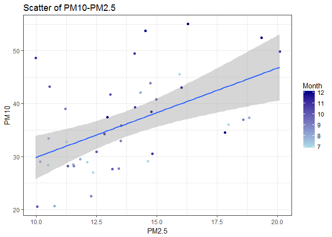
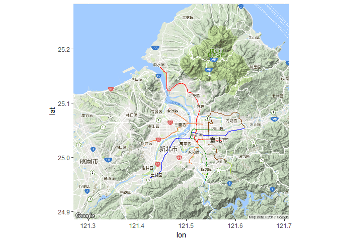
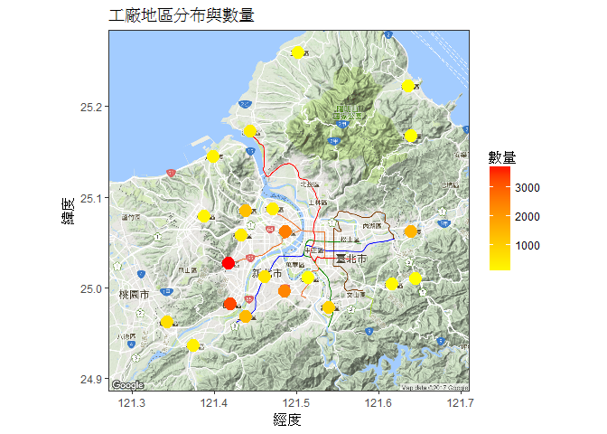
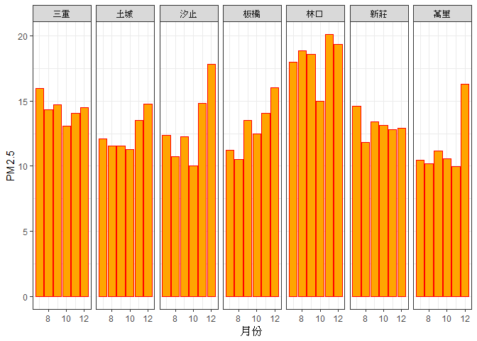
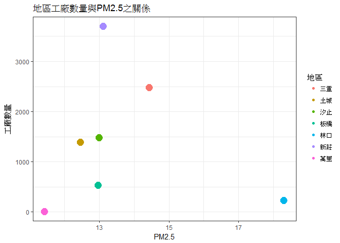
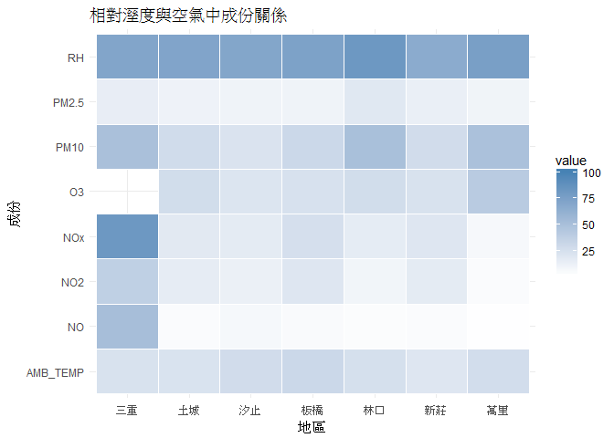

長庚大學 大數據分析方法 作業六
================

題目
====

空氣汙染與工廠數量

資料來源
========

我們使用的是行政院環境保護署(俗稱環保署)中空氣品質監測網的北部空氣品質歷年監測資料，以及政府資料開放平台中的新北市工廠登記清冊的資料。 空氣品質監測網：<http://taqm.epa.gov.tw/taqm/tw/YearlyDataDownload.aspx> 政府資料開放平台：<http://data.gov.tw/node/37370>

資料介紹
========

### 北部空氣品質的資料說明

關於讀入資料之欄位名稱及內容說明 普通測站資料註記說明： \`\# 表示儀器檢核為無效值 \* 表示程式檢核為無效值 x 表示人工檢核為無效值 NR 表示無降雨(已更改過) 空白 表示缺值

測項簡稱 單位 測項名稱 CO ppm 一氧化碳 PM10 μg/m3 懸浮微粒 PM2.5 μg/m3 細懸浮微粒 NOX ppb 氮氧化物 NO ppb 一氧化氮 NO2 ppb 二氧化氮 AMB\_TEMP ℃ 大氣溫度 RH % 相對溼度

### 新北市工廠登記清冊的資料說明

我們在眾多的資料(7萬多筆)中，只挑出STATUS(狀態)欄位為生產中的資料(2萬多筆)來進行分析比較。

資料格式
--------

新北市各監測站的的資料為XLS檔而工廠資料為CSV檔。

分析議題背景
============

PM 就是英文Particulate Matter（顆粒物）的縮寫。 PM10代表空氣中空氣動力學粒徑小於等於10微米的所有顆粒物； PM2.5代表空氣中空氣動力學粒徑小於等於2.5微米的所有顆粒物；又稱細顆粒，細顆粒進入肺泡。 由此可見，PM10中包含粒徑小於2.5微米的顆粒物，即PM10包含PM2.5。世界衛生組織（WHO）指出： 對於發展中國家的城市：PM10中有近一半是PM2.5； 對於已開發國家城市:PM10中PM2.5占50%至80%。由此，當空氣中PM2.5的濃度數據增加時，PM10的濃度數據就會升高。故目前歐盟國家仍然只監測PM10的濃度數據。 PM10能被人直接吸入呼吸道，但部分可通過痰液等排出體外，也會被鼻腔內部的絨毛阻擋，對人體健康危害相對較小。不過PM10對於能見度和溫度的影響非常明顯。

PM2.5對健康的危害
-----------------

### 呼吸系統

台灣吸菸人口下降，但肺腺癌發生率卻逐年上升。 肺癌的原因與空氣汙染有關，人們將PM2.5吸入肺裡沉積，將刺激肺癌發生。 根據世界衛生組織發表數據顯示，PM2.5濃度每增加10μm/m3死亡率會增加6%。

### 心血管、神經系統

研究發現，PM2.5通過呼吸可以到達肺部，這些顆粒物在肺泡上沉積下來，會干擾肺部的氣體交換，損傷肺泡和粘膜，引起肺組織的慢性纖維化，導致肺心病，加重哮喘病，引起慢性鼻咽炎、慢性支氣管炎等一系列病變，這些顆粒物還可以通過支氣管和肺泡進入血液，其中的有害氣體、重金屬等溶解在血液中，嚴重的可危及生命，對兒童和老年人的危害尤為明顯。

分析動機
--------

相信大家都對PM10及PM2.5這幾個名詞不陌生了，也知道它對人體健康會有危害，因此我們找出開放資料，就北部幾個區域於2016/7-12月的情況來比較看看到底是哪裡的空氣最髒，再來看看工廠在各區的分布多寡和空氣汙染的高低有沒有關聯。

假設
====

我們假設工廠的數量會跟空氣污染會有正相關，工廠數量越多，該區空氣品質越差。

分析
====

載入使用資料們
--------------

``` r
#這是R Code Chunk
library(readr)
library(readxl)
Banqiao <- read_excel("D:/BigDataHW/HW6/NewTaipeiCity/105年板橋站_20170217.xls")
Linkou <- read_excel("D:/BigDataHW/HW6/NewTaipeiCity/105年林口站_20170217.xls")
Sanchong <- read_excel("D:/BigDataHW/HW6/NewTaipeiCity/105年三重站_20170217.xls")
Tucheng <- read_excel("D:/BigDataHW/HW6/NewTaipeiCity/105年土城站_20170217.xls")
WanLi <- read_excel("D:/BigDataHW/HW6/NewTaipeiCity/105年萬里站_20170217.xls")
Xinzhuang <- read_excel("D:/BigDataHW/HW6/NewTaipeiCity/105年新莊站_20170217.xls")
Xizhi <- read_excel("D:/BigDataHW/HW6/NewTaipeiCity/105年汐止站_20170217.xls")
NewTaipeiFactoryLocation <- read_csv("D:/BigDataHW/HW6/NewTaipeiFactoryLocation_0002336861720153000188.csv")
```

    ## Parsed with column specification:
    ## cols(
    ##   PRF = col_character(),
    ##   FACT_NAME = col_character(),
    ##   REGI_ID = col_character(),
    ##   FACT_ADDR = col_character(),
    ##   RES_NAME = col_character(),
    ##   PRF8 = col_character(),
    ##   PRD8 = col_character(),
    ##   REGI_APP_DATE = col_character(),
    ##   STATUS = col_character()
    ## )

資料處理與清洗
--------------

``` r
#這是R Code Chunk
library(dplyr)
```

    ## 
    ## Attaching package: 'dplyr'

    ## The following objects are masked from 'package:stats':
    ## 
    ##     filter, lag

    ## The following objects are masked from 'package:base':
    ## 
    ##     intersect, setdiff, setequal, union

``` r
library(ggmap)
```

    ## Loading required package: ggplot2

``` r
#Banqiao
names(Banqiao)[names(Banqiao)=="日期"]="Date";
names(Banqiao)[names(Banqiao)=="測站"]="Station";
names(Banqiao)[names(Banqiao)=="測項"]="Item";
#Linkou
names(Linkou)[names(Linkou)=="日期"]="Date";
names(Linkou)[names(Linkou)=="測站"]="Station";
names(Linkou)[names(Linkou)=="測項"]="Item";
#Sanchong
names(Sanchong)[names(Sanchong)=="日期"]="Date";
names(Sanchong)[names(Sanchong)=="測站"]="Station";
names(Sanchong)[names(Sanchong)=="測項"]="Item";
#Tucheng
names(Tucheng)[names(Tucheng)=="日期"]="Date";
names(Tucheng)[names(Tucheng)=="測站"]="Station";
names(Tucheng)[names(Tucheng)=="測項"]="Item";
#WanLi
names(WanLi)[names(WanLi)=="日期"]="Date";
names(WanLi)[names(WanLi)=="測站"]="Station";
names(WanLi)[names(WanLi)=="測項"]="Item";
#Xinzhuang
names(Xinzhuang)[names(Xinzhuang)=="日期"]="Date";
names(Xinzhuang)[names(Xinzhuang)=="測站"]="Station";
names(Xinzhuang)[names(Xinzhuang)=="測項"]="Item";
#Xizhi
names(Xizhi)[names(Xizhi)=="日期"]="Date";
names(Xizhi)[names(Xizhi)=="測站"]="Station";
names(Xizhi)[names(Xizhi)=="測項"]="Item";

#7月
AirPollution.201607 <- rbind(
  Banqiao[grepl("2016/07",Banqiao$Date),],
  Linkou[grepl("2016/07",Linkou$Date),],
  Sanchong[grepl("2016/07",Sanchong$Date),],
  Tucheng[grepl("2016/07",Tucheng$Date),],
  WanLi[grepl("2016/07",WanLi$Date),],
  Xinzhuang[grepl("2016/07",Xinzhuang$Date),],
  Xizhi[grepl("2016/07",Xizhi$Date),])
AirPollution.201607 <- as.data.frame(AirPollution.201607)
for (i in 4:ncol(AirPollution.201607)) {
   if (!all(AirPollution.201607[,i] %in% c(" ","x","*","#"))) {
     AirPollution.201607[,i] <- as.numeric(AirPollution.201607[,i])
   }
}
AirPollution.201607$Average<- round(rowMeans(AirPollution.201607[, 4:27],na.rm = TRUE),2)
AirPollution.201607 <- AirPollution.201607[order(AirPollution.201607$Item, -AirPollution.201607$Average),]
#8月
AirPollution.201608 <- rbind(
  Banqiao[grepl("2016/08",Banqiao$Date),],
  Linkou[grepl("2016/08",Linkou$Date),],
  Sanchong[grepl("2016/08",Sanchong$Date),],
  Tucheng[grepl("2016/08",Tucheng$Date),],
  WanLi[grepl("2016/08",WanLi$Date),],
  Xinzhuang[grepl("2016/08",Xinzhuang$Date),],
  Xizhi[grepl("2016/08",Xizhi$Date),])
AirPollution.201608 <- as.data.frame(AirPollution.201608)
for (i in 4:ncol(AirPollution.201608)) {
   if (!all(AirPollution.201608[,i] %in% c(" ","x","*","#"))) {
     AirPollution.201608[,i] <- as.numeric(AirPollution.201608[,i])
   }
}
AirPollution.201608$Average<- round(rowMeans(AirPollution.201608[, 4:27],na.rm = TRUE),2)
AirPollution.201608 <- AirPollution.201608[order(AirPollution.201608$Item, -AirPollution.201608$Average),]
#9月
AirPollution.201609 <- rbind(
  Banqiao[grepl("2016/09",Banqiao$Date),],
  Linkou[grepl("2016/09",Linkou$Date),],
  Sanchong[grepl("2016/09",Sanchong$Date),],
  Tucheng[grepl("2016/09",Tucheng$Date),],
  WanLi[grepl("2016/09",WanLi$Date),],
  Xinzhuang[grepl("2016/09",Xinzhuang$Date),],
  Xizhi[grepl("2016/09",Xizhi$Date),])
AirPollution.201609 <- as.data.frame(AirPollution.201609)
for (i in 4:ncol(AirPollution.201609)) {
   if (!all(AirPollution.201609[,i] %in% c(" ","x","*","#"))) {
     AirPollution.201609[,i] <- as.numeric(AirPollution.201609[,i])
   }
}
AirPollution.201609$Average<- round(rowMeans(AirPollution.201609[, 4:27],na.rm = TRUE),2)
AirPollution.201609 <- AirPollution.201609[order(AirPollution.201609$Item, -AirPollution.201609$Average),]
#10月
AirPollution.201610 <- rbind(
  Banqiao[grepl("2016/10",Banqiao$Date),],
  Linkou[grepl("2016/10",Linkou$Date),],
  Sanchong[grepl("2016/10",Sanchong$Date),],
  Tucheng[grepl("2016/10",Tucheng$Date),],
  WanLi[grepl("2016/10",WanLi$Date),],
  Xinzhuang[grepl("2016/10",Xinzhuang$Date),],
  Xizhi[grepl("2016/10",Xizhi$Date),])
AirPollution.201610 <- as.data.frame(AirPollution.201610)
for (i in 4:ncol(AirPollution.201610)) {
   if (!all(AirPollution.201610[,i] %in% c(" ","x","*","#"))) {
     AirPollution.201610[,i] <- as.numeric(AirPollution.201610[,i])
   }
}
AirPollution.201610$Average<- round(rowMeans(AirPollution.201610[, 4:27],na.rm = TRUE),2)
AirPollution.201610 <- AirPollution.201610[order(AirPollution.201610$Item, -AirPollution.201610$Average),]
#11月
AirPollution.201611 <- rbind(
  Banqiao[grepl("2016/11",Banqiao$Date),],
  Linkou[grepl("2016/11",Linkou$Date),],
  Sanchong[grepl("2016/11",Sanchong$Date),],
  Tucheng[grepl("2016/11",Tucheng$Date),],
  WanLi[grepl("2016/11",WanLi$Date),],
  Xinzhuang[grepl("2016/11",Xinzhuang$Date),],
  Xizhi[grepl("2016/11",Xizhi$Date),])
AirPollution.201611 <- as.data.frame(AirPollution.201611)
for (i in 4:ncol(AirPollution.201611)) {
   if (!all(AirPollution.201611[,i] %in% c(" ","x","*","#"))) {
     AirPollution.201611[,i] <- as.numeric(AirPollution.201611[,i])
   }
}
AirPollution.201611$Average<- round(rowMeans(AirPollution.201611[, 4:27],na.rm = TRUE),2)
AirPollution.201611 <- AirPollution.201611[order(AirPollution.201611$Item, -AirPollution.201611$Average),]
#12月
AirPollution.201612 <- rbind(
  Banqiao[grepl("2016/12",Banqiao$Date),],
  Linkou[grepl("2016/12",Linkou$Date),],
  Sanchong[grepl("2016/12",Sanchong$Date),],
  Tucheng[grepl("2016/12",Tucheng$Date),],
  WanLi[grepl("2016/12",WanLi$Date),],
  Xinzhuang[grepl("2016/12",Xinzhuang$Date),],
  Xizhi[grepl("2016/12",Xizhi$Date),])
AirPollution.201612 <- as.data.frame(AirPollution.201612)
for (i in 4:ncol(AirPollution.201612)) {
   if (!all(AirPollution.201612[,i] %in% c(" ","x","*","#"))) {
     AirPollution.201612[,i] <- as.numeric(AirPollution.201612[,i])
   }
}
AirPollution.201612$Average<- round(rowMeans(AirPollution.201612[, 4:27],na.rm = TRUE),2)
AirPollution.201612 <- AirPollution.201612[order(AirPollution.201612$Item, -AirPollution.201612$Average),]

##7+8+9+10+11+12月
Air_Tidy<-rbind(
  AirPollution.201607[,-4:-27] %>% group_by(Station,Item) %>%
    summarise(
      Month= 7,
      Mean = mean(Average,na.rm = T)),
  AirPollution.201608[,-4:-27] %>% group_by(Station,Item) %>%
    summarise(
      Month= 8,
      Mean = mean(Average,na.rm = T)),
  AirPollution.201609[,-4:-27] %>% group_by(Station,Item) %>%
    summarise(
      Month= 9,
      Mean = mean(Average,na.rm = T)),
  AirPollution.201610[,-4:-27] %>% group_by(Station,Item) %>%
    summarise(
      Month= 10,
      Mean = mean(Average,na.rm = T)),
  AirPollution.201611[,-4:-27] %>% group_by(Station,Item) %>%
    summarise(
      Month= 11,
      Mean = mean(Average,na.rm = T)),
  AirPollution.201612[,-4:-27] %>% group_by(Station,Item) %>%
    summarise(
      Month= 12,
      Mean = mean(Average,na.rm = T))
  )
#Air_Tidy

##工廠清洗
factory_operate <- NewTaipeiFactoryLocation[grepl("生產中",NewTaipeiFactoryLocation$STATUS),]
factory_operate$Area <- substr(factory_operate$FACT_ADDR,4,6)
#找出各區工廠數量，再以數量排序
factory_Area_Qunality <- group_by(factory_operate,Area)%>%summarise(nQuantity=n_distinct(REGI_ID))
factory_Area_Qunality <- arrange(factory_Area_Qunality,desc(nQuantity))
#table(factory_operate$Area)

#工廠經緯度轉換 要跑很久別一直RUN
factory_Area<-geocode(factory_Area_Qunality$Area)
```

    ## Information from URL : http://maps.googleapis.com/maps/api/geocode/json?address=%E6%96%B0%E8%8E%8A%E5%8D%80&sensor=false

    ## Information from URL : http://maps.googleapis.com/maps/api/geocode/json?address=%E6%A8%B9%E6%9E%97%E5%8D%80&sensor=false

    ## Information from URL : http://maps.googleapis.com/maps/api/geocode/json?address=%E4%B8%89%E9%87%8D%E5%8D%80&sensor=false

    ## Information from URL : http://maps.googleapis.com/maps/api/geocode/json?address=%E4%B8%AD%E5%92%8C%E5%8D%80&sensor=false

    ## Information from URL : http://maps.googleapis.com/maps/api/geocode/json?address=%E6%B1%90%E6%AD%A2%E5%8D%80&sensor=false

    ## Information from URL : http://maps.googleapis.com/maps/api/geocode/json?address=%E5%9C%9F%E5%9F%8E%E5%8D%80&sensor=false

    ## Information from URL : http://maps.googleapis.com/maps/api/geocode/json?address=%E4%BA%94%E8%82%A1%E5%8D%80&sensor=false

    ## Information from URL : http://maps.googleapis.com/maps/api/geocode/json?address=%E6%96%B0%E5%BA%97%E5%8D%80&sensor=false

    ## Information from URL : http://maps.googleapis.com/maps/api/geocode/json?address=%E9%B6%AF%E6%AD%8C%E5%8D%80&sensor=false

    ## Information from URL : http://maps.googleapis.com/maps/api/geocode/json?address=%E6%9D%BF%E6%A9%8B%E5%8D%80&sensor=false

    ## .

    ## Information from URL : http://maps.googleapis.com/maps/api/geocode/json?address=%E6%B3%B0%E5%B1%B1%E5%8D%80&sensor=false

    ## .

    ## Information from URL : http://maps.googleapis.com/maps/api/geocode/json?address=%E6%B7%A1%E6%B0%B4%E5%8D%80&sensor=false

    ## .

    ## Information from URL : http://maps.googleapis.com/maps/api/geocode/json?address=%E8%98%86%E6%B4%B2%E5%8D%80&sensor=false

    ## .

    ## Information from URL : http://maps.googleapis.com/maps/api/geocode/json?address=%E4%B8%89%E5%B3%BD%E5%8D%80&sensor=false

    ## .

    ## Information from URL : http://maps.googleapis.com/maps/api/geocode/json?address=%E5%85%AB%E9%87%8C%E5%8D%80&sensor=false

    ## .

    ## Information from URL : http://maps.googleapis.com/maps/api/geocode/json?address=%E6%9E%97%E5%8F%A3%E5%8D%80&sensor=false

    ## .

    ## Information from URL : http://maps.googleapis.com/maps/api/geocode/json?address=%E6%B7%B1%E5%9D%91%E5%8D%80&sensor=false

    ## .

    ## Information from URL : http://maps.googleapis.com/maps/api/geocode/json?address=%E7%91%9E%E8%8A%B3%E5%8D%80&sensor=false

    ## .

    ## Information from URL : http://maps.googleapis.com/maps/api/geocode/json?address=%E4%B8%89%E8%8A%9D%E5%8D%80&sensor=false

    ## .

    ## Information from URL : http://maps.googleapis.com/maps/api/geocode/json?address=%E6%B0%B8%E5%92%8C%E5%8D%80&sensor=false

    ## .

    ## Information from URL : http://maps.googleapis.com/maps/api/geocode/json?address=%E9%87%91%E5%B1%B1%E5%8D%80&sensor=false

    ## .

    ## Information from URL : http://maps.googleapis.com/maps/api/geocode/json?address=%E8%90%AC%E9%87%8C%E5%8D%80&sensor=false

    ## .

    ## Information from URL : http://maps.googleapis.com/maps/api/geocode/json?address=%E7%9F%B3%E9%96%80%E5%8D%80&sensor=false

    ## .

    ## Information from URL : http://maps.googleapis.com/maps/api/geocode/json?address=%E7%9F%B3%E7%A2%87%E5%8D%80&sensor=false

    ## .

    ## Information from URL : http://maps.googleapis.com/maps/api/geocode/json?address=%E8%B2%A2%E5%AF%AE%E5%8D%80&sensor=false

    ## .

    ## Information from URL : http://maps.googleapis.com/maps/api/geocode/json?address=%E5%B9%B3%E6%BA%AA%E5%8D%80&sensor=false

    ## .

    ## Information from URL : http://maps.googleapis.com/maps/api/geocode/json?address=%E5%9D%AA%E6%9E%97%E5%8D%80&sensor=false

    ## Information from URL : http://maps.googleapis.com/maps/api/geocode/json?address=%E9%9B%99%E6%BA%AA%E5%8D%80&sensor=false

``` r
factory_Area_Qunality<-cbind(factory_Area_Qunality,factory_Area)

##工廠數量&PM2.5之關係整理
a <- Air_Tidy[grepl("PM2.5",Air_Tidy$Item),c("Station","Item","Mean")] %>% group_by(Station) %>%
    summarise(Mean = mean(Mean,na.rm = T))
b <- rbind(factory_Area_Qunality[grepl("三重",factory_Area_Qunality$Area),c("Area","nQuantity")],
           factory_Area_Qunality[grepl("土城",factory_Area_Qunality$Area),c("Area","nQuantity")],
           factory_Area_Qunality[grepl("汐止",factory_Area_Qunality$Area),c("Area","nQuantity")],
           factory_Area_Qunality[grepl("板橋",factory_Area_Qunality$Area),c("Area","nQuantity")],
           factory_Area_Qunality[grepl("林口",factory_Area_Qunality$Area),c("Area","nQuantity")],
           factory_Area_Qunality[grepl("新莊",factory_Area_Qunality$Area),c("Area","nQuantity")],
           factory_Area_Qunality[grepl("萬里",factory_Area_Qunality$Area),c("Area","nQuantity")])
b$Area <-sub("區","",b$Area)   
names(b)[names(b)=="Area"]="Station"
Relationship <- merge(a, b, by = "Station")
```

圖片資料處理
------------

``` r
##作圖事前準備
library(gplots)
```

    ## Warning: package 'gplots' was built under R version 3.3.3

    ## 
    ## Attaching package: 'gplots'

    ## The following object is masked from 'package:stats':
    ## 
    ##     lowess

``` r
library(tidyverse)
```

    ## Warning: package 'tidyverse' was built under R version 3.3.3

    ## Loading tidyverse: tibble
    ## Loading tidyverse: tidyr
    ## Loading tidyverse: purrr

    ## Warning: package 'tibble' was built under R version 3.3.3

    ## Warning: package 'tidyr' was built under R version 3.3.3

    ## Warning: package 'purrr' was built under R version 3.3.3

    ## Conflicts with tidy packages ----------------------------------------------

    ## filter(): dplyr, stats
    ## lag():    dplyr, stats

``` r
library(maps)
```

    ## Warning: package 'maps' was built under R version 3.3.3

    ## 
    ## Attaching package: 'maps'

    ## The following object is masked from 'package:purrr':
    ## 
    ##     map

``` r
library(maptools)
```

    ## Warning: package 'maptools' was built under R version 3.3.3

    ## Loading required package: sp

    ## Warning: package 'sp' was built under R version 3.3.3

    ## Checking rgeos availability: TRUE

``` r
library(reshape2)
```

    ## Warning: package 'reshape2' was built under R version 3.3.3

    ## 
    ## Attaching package: 'reshape2'

    ## The following object is masked from 'package:tidyr':
    ## 
    ##     smiths

``` r
library(tidyr)
library(ggplot2)
library(showtext)
```

    ## Warning: package 'showtext' was built under R version 3.3.3

    ## Loading required package: sysfonts

    ## Warning: package 'sysfonts' was built under R version 3.3.3

``` r
showtext.auto(enable = TRUE)

##長轉寬
Air_Tidy.s <- spread(Air_Tidy, Item, Mean)
##寬轉長
Air_Tidy.m <- melt(Air_Tidy, id.vars = c("Station","Month","Item"))

#雙變量----PM10跟PM2.5的相關性，資料超過30筆看起來似乎有相關
cor(Air_Tidy.s$PM10,Air_Tidy.s$PM2.5)
```

    ## [1] 0.5141622

``` r
#散佈圖(是否PM10越高則PM2.5越高，因為PM10包含2.5)
ggplot(data=Air_Tidy.s) +   
    # 散布圖對應的函式是geom_point()
    geom_point(aes(x=PM2.5,  # 用aes()，描繪散布圖內的各種屬性
                   y=PM10,
                   color=Month
                   )
               )+
  # 用geom_smooth()加上趨勢線
  geom_smooth(aes(x=PM2.5,
                  y=PM10),method='lm') +
  scale_color_continuous(low = "lightblue",high = "darkblue")+
  # 用labs()，進行文字上的標註(Annotation)
  labs(title="Scatter of PM10-PM2.5",
         x="PM2.5",
         y="PM10") + theme_bw()+
  theme(text=element_text(family="wqy-microhei"))
```



``` r
##工廠分布圖
TaipeiMap <- get_map(
    location = c(121.34,24.93,121.64,25.24), 
    zoom = 11,maptype = 'terrain',language = "zh-TW") ## 地勢圖 中文
```

    ## Warning: bounding box given to google - spatial extent only approximate.

    ## converting bounding box to center/zoom specification. (experimental)

    ## Map from URL : http://maps.googleapis.com/maps/api/staticmap?center=25.085,121.49&zoom=11&size=640x640&scale=2&maptype=terrain&language=zh-TW&sensor=false

``` r
ggmap(TaipeiMap)
```



``` r
TaipeiMapO <- ggmap(TaipeiMap)+ 
    geom_point(data=factory_Area_Qunality,
               aes(x=lon, y=lat,
                   color=nQuantity,size=1)
               )+
  scale_color_continuous(low = "yellow",high = "red")+
  guides(size=FALSE)+
  labs(title="工廠地區分布與數量",
         x="經度",
         y="緯度",color="數量") + theme_bw()+
  theme(text=element_text(family="wqy-microhei"))
TaipeiMapO
```

    ## Warning: Removed 6 rows containing missing values (geom_point).



``` r
#長條圖//這裡要+
qplot(Month, data = Air_Tidy.s, geom = "bar", weight = PM2.5) + facet_grid(.~Station)+
  xlab("月份")+ylab("PM2.5")+
  geom_bar(stat = 'count', fill = 'orange', colour = 'red')+ theme_bw()+
  theme(text=element_text(family="wqy-microhei"))
```



``` r
#製作空氣汙染與工廠數量關係圖表
ggplot(data=Relationship) +   
    # 散布圖對應的函式是geom_point()
    geom_point(aes(x=Mean,  # 用aes()，描繪散布圖內的各種屬性
                   y=nQuantity,
                   color=Station,
                   size=5
                   )
               )+guides(size=FALSE)+
  # 用labs()，進行文字上的標註(Annotation)
  labs(title="地區工廠數量與PM2.5之關係",
         x="PM2.5",
         y="工廠數量",color="地區") + theme_bw()+
  theme(text=element_text(family="wqy-microhei"))
```



``` r
##把風向風速降雨、雨導電、紫外線、PH、CO、CH4值等較無用資料拿掉
air_t.m<-Air_Tidy.m
airduce<-rbind(Air_Tidy.m[grepl("WIND_DIREC",Air_Tidy.m$Item),],Air_Tidy.m[grepl("WD_HR",Air_Tidy.m$Item),],Air_Tidy.m[grepl("WIND_SPEED",Air_Tidy.m$Item),],Air_Tidy.m[grepl("WS_HR",Air_Tidy.m$Item),],Air_Tidy.m[grepl("PH_RAIN",Air_Tidy.m$Item),],Air_Tidy.m[grepl("RAINFALL",Air_Tidy.m$Item),],Air_Tidy.m[grepl("UVB",Air_Tidy.m$Item),],Air_Tidy.m[grepl("THC",Air_Tidy.m$Item),],Air_Tidy.m[grepl("NMHC",Air_Tidy.m$Item),],Air_Tidy.m[grepl("RAIN_COND",Air_Tidy.m$Item),],Air_Tidy.m[grepl("CO",Air_Tidy.m$Item),],Air_Tidy.m[grepl("CH4",Air_Tidy.m$Item),],Air_Tidy.m[grepl("SO2",Air_Tidy.m$Item),])
##存入
air_t.m<-anti_join(air_t.m,airduce)
```

    ## Joining, by = c("Station", "Month", "Item", "variable", "value")

``` r
##作圖
ggplot(air_t.m, aes(Station,Item)) + 
    geom_tile(aes(fill = value),
              colour = "white")+
    scale_fill_gradient(low = "white", high = "steelblue", na.value ="grey50")+
  labs(title="相對溼度與空氣中成份關係",
         x="地區",
         y="成份",color="數值") +
  theme(text=element_text(family="wqy-microhei"))+
theme_minimal()
```



分析結果
========

1.地區工廠數量與PM2.5可能有關，但沒有那麼相關。 2.因此我們又做了一張Heatmap，試圖用現有的資料去找出原因，但發現其中有很多都是空值，比如風向風速，大多沒有紀錄值，把無用資料刪去以後，得到一個結果是靠海邊的地區PM2.5比較高。 3.這些可能跟沙子有關，也可能就是從旁邊那個國家吹過來的，像是比較高的林口跟萬里都是比較靠海的地區；所以，假如要做進一步的檢測，或許可以從風向與風速去進行，或是用工廠的種類去做檢測。

分析結果可能解決的問題
======================

我們需要用海邊與內陸區域分開分析來證實是否跟我們結果所架設相關，也需要分析不同工廠類別、規模來真正了解哪一類的工廠，真正與空氣汙染有關，從而提醒政府加以限制其工廠的廢氣排放，給我們人民一個不對健康造成影響的環境，及一個能永續發展的地球。

組員名單與分工
==============

B0344223 劉益坤負責資料處理及書面報告；B0344209 蕭瑞文負責圖片處理及報告，PPT由兩人共同製作。
